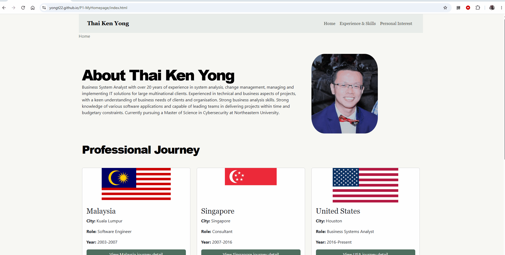

# Thai Ken Yong Personal Home Page

## Author

Thai Ken Yong

## Project Description

This project is a personal and professional portfolio website for Thai Ken Yong. The site presents my background, professional experience, technical skills and personal interests in a clean multi-page format.

## Project Objective

The goal of this assignment was to create a personal homepage that introduces my professional profile, highlights my career journey and shares a bit of my personal interests in a visually organized and responsive website.

## Course

CS5610 Web Development  
Northeastern University  
Course Link: https://johnguerra.co/classes/webDevelopment_online_fall_2026/

## Submission URL

- Deployed URL (GitHub Pages): https://yongt22.github.io/P1-MyHomepage/
- Presentation (Google Slides): https://docs.google.com/presentation/d/1kSBxDpg61QXuLer6170vcS_WKcWZCB46TQhLVu0RnYE/edit?usp=sharing
- Video Demonstration: https://youtu.be/igSzgIBO_kQ

## Technologies Used

- HTML5
- CSS3
- Bootstrap 5
- Vanilla JavaScript (ES6 Modules)
- ESLint
- Prettier
- Git & GitHub
- GitHub Pages

## Pages Included

### Home

The Home page introduces my professional profile and includes a short biography, profile image, featured projects and the interactive Professional Journey section.

### Experience & Skills

The Experience & Skills page highlights my career timeline, professional roles and technical background across several major stages of my work experience.

### Personal Interest

The Personal Interest page presents a baking-themed gallery and reflects a personal hobby and creative side of my life.

## Creative Addition

The Home page includes an interactive Professional Journey feature built with vanilla JavaScript. Users can click on Malaysia, Singapore or United States to view different stages of my professional journey and learn more about each period of my career.

## Instructions to Build & Run

### Prerequisites

- Node.js
- npm
- A modern web browser

This is a static front-end website, so there is no build step. Node.js and npm are used for development tools such as ESLint and Prettier.

### 1. Clone the repository

```bash
git clone https://github.com/yongt22/P1-MyHomepage.git
cd P1-MyHomepage
```

### 2. Install dependencies

```bash
npm install
```

This installs the development dependencies listed in `package.json`, including ESLint and Prettier.

### 3. Run the website locally

Run the project using a local development server, such as VS Code Live Server or another static HTTP server.

The website contains three main pages:

- `index.html` — Home - My introduction
- `experience.html` — Experience & Skills - Working experience, skills, education and certificates
- `interest.html` — Personal Interest - My baking pictures from my Instagram account. This is AI generated HTML page

### 4. View the deployed website

The website is also publicly available through GitHub Pages:

https://yongt22.github.io/P1-MyHomepage/

## Screenshot



## Demo Video

[Project 1 Personal Homepage Demo](https://youtu.be/igSzgIBO_kQ)

## Image and Resource Attribution

The project uses local image assets stored in [images](images), including the profile photo, country flag graphics and artwork used across the site.

- Malaysia, Singapore and USA flag images: Flagpedia.net — Public Domain, based on vector files from Wikimedia Commons. https://flagpedia.net/download
- favicon.ico: Generated using ChatGPT image generation based on a prompt written by Thai Ken Yong.
- Baking images: Personal photos by Thai Ken Yong.
- Profile photo: Personal photo by Thai Ken Yong.

## Generative AI Usage

### GitHub Copilot model MAI-Code-1.1-Flash

#### Personal Interest Page

**Usage:**
The first two pages were created manually. The Personal Interest page was intentionally generated using GitHub Copilot as the required AI-generated third page for this assignment. The generated result was then reviewed and adjusted to better match the overall website style and content.

**Prompt:**

```text
Attached `Interest Page.png` is my mockup for the Personal Interest page. Following the mockup, generate an `interest.html` file without modifying my existing HTML, CSS, JavaScript, or any other files. The Personal Interest page should follow the same navigation bar and footer design as `index.html`. You may use Bootstrap, but use the same Bootstrap version that I am currently using in `index.html`.

For the baking pictures, you may use pictures from my baking Instagram: `https://www.instagram.com/t.kenscrumptious/`. If you cannot access the pictures, use placeholders and I will replace them later. Make the page responsive and follow the layout shown in the attached mockup.
```

#### README.md

**Usage:**
Create README.md file

**Prompt:**

```text
Help me generate the README.md for my CS5610 Project 1 personal homepage. Please look at my existing project files first so the README matches what I actually built. Don't modify any of my other files. My website is a personal and professional portfolio and it is deployed here: [https://yongt22.github.io/P1-MyHomepage/](https://yongt22.github.io/P1-MyHomepage/).

For the README, please include the project name and description, project objective, author, deployed website link, technologies I used, how to install the project with npm install, and how to run/view the website locally.
Also briefly explain the 3 pages I created: Home, Experience & Skills and Personal Interest. Please mention my creative addition which is the interactive Professional Journey on the Home page. I created this using vanilla JavaScript and the user can click Malaysia, Singapore or United States to see the different stages of my professional journey.
Add a section for a screenshot and demo video. You can leave placeholders for me to add them later. Also include the MIT License that is already in my project and a section for image/resource attribution.

I also need a Generative AI Usage section for my assignment. The first 2 pages were created manually by me and the Personal Interest page was intentionally generated using GitHub Copilot as the AI-generated third page required by the assignment. If you cannot find this information from my project, just leave a TODO for me instead of making something up.
Keep the README simple and professional. Don't add features, technologies, sources, AI prompts or other information that you cannot find from my project.
```

### ChatGPT model GPT-5.6 Sol.

#### favicon.ico

**Usage:**
Create favicon.ico

**Prompt:**

```text
Create a minimalist square favicon for a personal portfolio website. Use the initials "KY" as the central design. Use a black background with bold white sans-serif letters. Keep the design clean, modern, professional, and highly legible at very small sizes. It need to be ico file.
```

#### Learning

**Usage:**
ChatGPT was used as a learning tool during the project. It was used to explain the web development concept and best practice.
The first two website pages and the original JavaScript functionality were created manually without ChatGPT code generation.

**Example Prompt:**

```text
Any plug in I should install that will help me with that kind of careless mistake?
What is the best practice on creating a HTML file?
```

## Repository Files

- [index.html](index.html) - Home page
- [experience.html](experience.html) - Experience & Skills page
- [interest.html](interest.html) - Personal Interest page
- [css/style.css](css/style.css) - Styling for the site
- [js/main.js](js/main.js) - JavaScript for the interactive professional journey

## License

This project is licensed under the MIT License. See [LICENSE](LICENSE).
